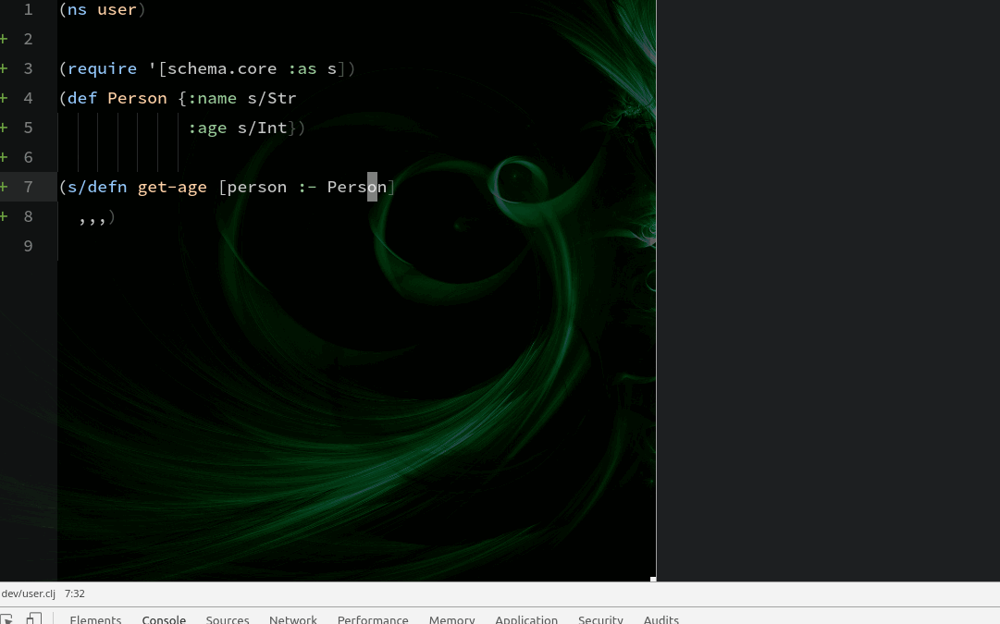

# Extending Chlorine

It is possible to add support for additional commands not included on Chlorine. Atom supports init scripts where you can configure more commands, change the behavior of the editor, and so on. To do so, just run "Open your Init Script" on the editor's command pallete and you'll se or a Javascript or a CoffeeScript file, where you can use the Atom API to add commands, change behaviors, etc.

To add a command on the editor, you first need to wait for the package to activate. Then, you need to pick up the main module, and there's a property that contains code that is meant to be extended. This works better with an example: suppose you want to add support for Prismatic Schema: you want to describe the Schema that currently is under the cursor. You can do that with the following sequence of commands (example in Javascript, please convert to CoffeeScript if necessary):

```javascript
// This waits for the package to load
atom.packages.activatePackage('chlorine').then(package => {
  // This picks up the "main module" of the package
  const pkg = package.mainModule

  // This will add a command called "chlorine:explain-schema". You can check
  //it on the command pallete
  atom.commands.add('atom-text-editor', 'chlorine:explain-schema', function() {
    // pkg.ext.get_var() gets the current var under the cursor. There's also
    //pkg.ext.get_block() and pkg.ext.get_top_block()
    const result = pkg.ext.get_var()
    // Need to check if the current cursor position points to a valid Clojure
    // var or points to whitespace, comments, etc
    if(result.text) {
      // Interpolate command with Prismatic Schema's explain code
      const cmd = `
        (if (satisfies? schema.core/Schema ${result.text})
        (schema.core/explain ${result.text})
        (or (:schema (meta (ns-resolve *ns* '${result.text})))
        (clojure.edn/read-string (clojure.repl/source-fn '${result.text}))))`
      // This line will run the code, and present on the screen, the same way
      // that we evaluate commands. We need the command to evaluate, and the
      // current range so Chlorine knows where to put the result
      pkg.ext.evaluate_and_present(cmd, result.range)
    }
  })
})
```

Example of the above code running:



## API

Once you've got the package's `mainModule`, inside `.ext` there are 4 commands to help you extend functionality:

* `pkg.ext.get_top_block()` will get the current top block of the active text editor.
* `pkg.ext.get_block()` will get the current block. Please notice that `#(+ 1 2)` will return the anonymous function, not the `(+ 1 2)` and getting top block of `@(:some value)` will deref that current value (but `(deref (:some value))`, if your cursor is pointed inside `:some`, for example, will return the atom).
* `pkg.ext.get_var()` will get the current var under the cursor. If the editor's position is over a parenthesis, will get the whole form
* `pkg.ext.get_selection()` will get the current selection in the current editor. Please notice that it may be not a valid Clojure code
* `pkg.ext.get_namespace()` will get the current namespace name, with the full range of it.

All the above commands return `{text: string? range: array?}`. If both are `null`, it means that the current cursor position/selection does not point to a valid Clojure form or var (maybe it's a whitespace, or maybe it's inside a comment, for example). If one is present, the other will be present too.

`range` is a 2x2 array containing: `[[startRow, startCol], [endRow, endCol]]`. If both start and end are equal, it means that there's nothing selected.

* `pkg.ext.evaluate_and_present(code, range)` will evaluate the `code`, inside the current `range`, and it'll render on the screen. It expects the code to evaluate, and the current range (so it knows where to render on the screen).
